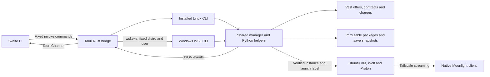

# Vastgame app architecture

This document describes the shipped desktop and its connection to the shared
Vastgame engine. The app is a local Tauri 2 window with Svelte 5, TypeScript and
custom CSS. It runs one active rig controller per window. There is no web server,
account database, separate app rental engine or general-purpose shell API.

For the underlying storage/runtime design, see [system architecture](../docs/architecture.md).
For persisted session fields and billing rules, see [sessions](../docs/sessions.md).
For contributor layout rules, see [AGENTS.md](AGENTS.md).

## Process boundaries

`src/main.ts` mounts `App.svelte`. `src-tauri/src/main.rs` creates the native
window and registers the fixed IPC commands. A production `pnpm build:app`
embeds Vite's `dist/` with Tauri's production protocol. A plain Cargo build can
retain the development URL and fail with a refused localhost connection when
Vite is absent; it is not the app packaging command.

On Linux, `backend::command` starts `~/.local/bin/vastgame` and adds the local
binary directory to PATH. On Windows it starts `wsl.exe --distribution Vastgame
--user vastgame --exec` and the fixed WSL CLI path. The installed Windows shell
wrapper selects the packaged backend and native Tailscale/Moonlight helpers.
The webview never chooses an executable, shell command, account key or file path.

## UI composition and ownership

| Area | Owner | Behavior |
| --- | --- | --- |
| Window and navigation | `App.svelte`, `navigation.ts`, `theme.css` | App name, account balance, Home/Sessions/Billing/Settings, native window controls, selected rig |
| Home | `home/HomePage.svelte` | Three adjacent library, host and game-panel columns |
| Library | `library/` | Shared game catalog, cover-only cards, artwork, metadata, Play and Home Logs |
| Hosts | `hosts/` | One request queue, local filters/sorting, selectable pills, expandable specs and selected-rig summaries |
| Rig lifecycle | `session/launch.svelte.ts` | The single Play/Connect/Shutdown/restore controller reused across tabs |
| Sessions | `sessions/` | History filters, banner cards, actions, right-side details and archive readers |
| Settings | `settings/` | Draft streaming/host preferences, Save/Reset and confirmed sensitive actions |
| Account balance | `account/` | Available credit only, single request and focus-triggered refresh cooldown |
| Shared presentation | `components/` | Buttons, dropdowns, popups, panel surface, logs, clipboard and scrolling |

Billing is currently an empty tab; it is not a charge dashboard. The cover gear
is deliberately inactive. Standalone Hosts/Library tabs and pages are removed.

Every action uses `Button.svelte`: size, rounded shape, semantic tone, focus,
disabled state and color fades live there. No buttons or covers zoom.
`Dropdown.svelte` reuses `Popover.svelte` and adds search to large choice lists.
Menus scroll with wheel/touch/keyboard and hide the native scrollbar. Notices
fade after two seconds; destructive Settings confirmations and detailed results
use the existing persistent popup mode, with viewport-safe placement.

`DetailsPanel.svelte` owns the right-side surface used by Home and Sessions.
`LogOutput.svelte` owns both console and stage-event viewers: full-width text,
an 8px inset, hidden scrollbar, Copy and optional Compress. Copy confirmation
expands left for one second. Collapsing a Sessions viewer restores the summary
inside the same panel; it does not replace the whole app screen.

`--page-margin` is 24px, or 12px at viewport heights up to 800px. The native
minimum is 600×600. Settings keeps both columns without page scrolling and sizes
its rows against actual available height. Streaming fills the remaining left
column above Sensitive settings, keeping that box's bottom at the page margin.
Sensitive rows use compact shared 32px buttons and gain padding in taller windows.
Per-box width queries keep labels and controls within their margins.

## Native API

| Rust command | Shared CLI operation | Purpose |
| --- | --- | --- |
| `browse_library` | `list --json` | Public game summaries |
| `browse_hosts` | `hosts --json --game ID` | Game-sized, scored public offers |
| `game_artwork` | `artwork --game ID cover/banner` | Identity and cached image |
| `game_details` | `details STEAM_APP_ID` | Separate cached description/reviews request |
| `account_balance` | `balance --json` | Available USD credit only |
| `quote_game` | `quote GAME OFFER MACHINE` | Exact game-specific quote; no rental |
| `launch_game` | `desktop-launch ...` | Validated explicit launch with event channel |
| `connect_game` | `desktop-connect JOB` | Resume preparation and stream on the exact VM |
| `shutdown_game` | `desktop-shutdown JOB [--force]` | Protected or explicit force shutdown |
| `current_launch` | `desktop-session [JOB]` | Reconcile durable identity and observed state |
| `follow_launch` | `desktop-watch JOB` | Follow local job/log changes |
| `browse_sessions` | `sessions --json ...` | Filtered local history and explicit charge refresh |
| `prepare_session` | `desktop-history-prepare ID [--shutdown]` | Exact live adoption or historical re-rental preparation |
| `session_logs`, `session_events` | `sessions log-page/event-page ID` | Bounded archive pages |
| `read_settings`, `save_settings`, `reset_settings` | `desktop-settings ...` | Shared validated preferences |
| `sensitive_settings` | `desktop-sensitive force-stop/delete-history` | Confirmed destructive actions with streamed results |

Rust rejects malformed IDs, action names, filters and oversized settings payloads.
It passes process arguments separately, without shell interpolation. Read-style
calls have a 75-second inner deadline, an 85-second outer deadline, an 8MiB stdout
limit and a 64KiB diagnostic capture limit. Lifecycle calls use a streaming runner
without that read timeout. Event lines are bounded at the native boundary.

The content security policy permits bundled scripts/images and native IPC, not
arbitrary web fetches. Public Steam requests happen in the Python backend.
Window capabilities are limited to the required event and frame operations.

## Browsing and artwork

Home activates the shared library and preferences, then requests offers sized
for the selected game. The host queue keeps one request active and retains only
the latest queued selection. Superseded responses cannot replace current data.
GPU, continent, price and sort controls filter the returned catalog locally;
slider movement does not call Vast. All matching host pills are displayed.

Python/shell share eligibility, disk sizing and the jq scorer. Verified-only and
minimum download/upload/VRAM/RAM preferences filter candidates. Country-distance
preference and preferred GPU influence Best value. Distance is a geographic
estimate, not a measured route. Runtime compatibility checks remain; the removed
network qualification system does not block poor routes or high latency.

Library summaries read manifests without launching games. Presentation identity
uses explicit metadata, Ludusavi aliases and, when needed, a unique exact public
Steam match. Ambiguous names remain placeholders. Artwork loads near visibility
and panel selection through two concurrent frontend requests. Covers/banners
share a bounded 64MiB disk cache; the frontend image cache retains at most 32
entries or 8MiB of encoded characters. Offscreen covers release their images.
Descriptions/reviews use their own request and 24-hour caches; they are not
returned by the artwork operation. Frontend metadata retains at most 128 entries.

## Play, progress and reconnect

1. Play waits for initial session reconciliation. Unknown creation or lookup
   failure blocks replacement rentals. Selecting a host alone never rents.
2. The controller validates selection/package availability, then refreshes the
   exact offer at the game's required storage allocation.
3. Typed errors distinguish availability, compatibility, disk, price, timeout
   and authentication failures. A price increase needs another explicit Play
   click. Historical re-rental is capped at 110% of the previous total rate.
4. `desktop_launch.py` reserves a unique `vastgame-<number>` session ID and a
   separate 32-hex job ID before creation. The manager revalidates the offer,
   publishes verified runtime/manifest objects, and requests a VM from Vast.
5. The contract is recovered by its exact unique label. Lost/unknown creation
   responses retain that identity and block replacement; they never imply no
   billing. The job, provider contract and label bind every later operation.
6. Startup waits for the guest, Tailscale identity, game restore, Proton/runtime,
   save restore and Wolf. Native Moonlight opens only after readiness checks.

The frontend batches visible logs and keeps 500 entries. `desktop_launch.py`
redacts engine output, writes rotating job logs and appends compressed durable
session archives. JSON progress travels through a Tauri channel. Home's selected
rig pill switches to a horizontal stage/activity/transfer summary; hover or
keyboard focus reveals the launch snapshot. Its elapsed timer starts at Play,
survives reconnect/reopening and stops only after confirmed absence or a
preflight failure that never rents. It is not billed time.

Five canonical stages are Booting rig, Restoring game, Preparing runtime,
Restoring saves and Starting game. Bytes, percentage and ETA require fresh
measured transfer data; boot and overall ETA are not invented. Running means
the configured game process was detected, not that successful rendering was
verified. Guest state shown after reconciliation is labelled last confirmed.

Any retained VM exposes Vast Connect and the matching X. Connect verifies its
job, contract and label, resumes the same readiness pipeline and never rents.
Window focus and explicit Refresh reconcile state; there is no idle provider
polling. Local inotify/process events follow an active launch. Closing the app
does not destroy a VM or cancel its backend rental operation.

Cancellation invalidates in-flight quotes as well as launch/reconnect results.
A quote arriving after Force shutdown all cannot submit a late replacement VM
or overwrite the shutdown state. Native and backend locks still enforce their
own admission/identity checks.

## Shutdown and sensitive actions

Protected shutdown blocks further game launches, asks the game's window to
close, then uses scoped SIGTERM if needed. Process IDs and exact Wine prefix
are rechecked; unrelated processes are not terminated. Wine registry flush,
verified idle state, verified save snapshot and provider absence precede a
success message. The original label is rechecked at final destruction.

A verified guest lifetime guard can prove no game ever started and skip backup.
Provider provisioning status or a missing local game flag cannot prove this.
Unavailable guest access retains the VM in the protected path.

During startup/reconnect, or on another X after a shutdown request, the explicit
force path bypasses guest access/backup and cancels only the pinned owned worker.
It still verifies contract/label and waits for provider absence. Unbacked saves
can be lost. Late worker writes cannot revive a stopped record.

Sensitive settings requires confirmation. Force shutdown all serializes the
operation, cancels owned workers, holds the local lifecycle lock, enumerates
only canonical Vastgame-labelled account instances and invokes the same exact
force-stop path per rig. Failures remain visible; no unconfirmed deletion is
called successful. Delete history erases summaries and compressed archives while
retaining hidden identity tombstones. Active rig controls and remote saves remain
intact, and late writers/legacy imports cannot recreate erased history.

## Persistence and session details

| Location | Contents and lifetime |
| --- | --- |
| `~/.config/vastgame/games/<id>/manifest.json` | Game/package/save policy metadata |
| `~/.config/vastgame/stream.json` | Linux Moonlight preferences |
| Installed Windows app's `stream.json` | Windows native stream preferences |
| `~/.config/vastgame/host_preferences.json` | Scoring preferences and browse minimums |
| `~/.local/state/vastgame/desktop/<job>/` | Durable rig control identity and rotating active logs |
| `~/.local/state/vastgame/sessions/<session>/` | Summary, stage journal and compressed redacted logs |
| `~/.local/state/vastgame/reports/<instance>/` | Bounded failure evidence, not automatically uploaded |
| `~/.cache/vastgame/` | Rebuildable identity, artwork and metadata caches |

XDG overrides apply to the corresponding Linux/WSL roots. Credentials stay in
the existing private Vast/rclone/bootstrap configuration, outside public releases.

Session cards display game, observed play time, GPU/VRAM/flag, state and total
cost. The right panel reads local details and paged logs/events. Events come from
the stage journal, not every console line. Copy follows every archive page up
to a 32MiB clipboard limit and reports unavailable historic output.

Reported charges are attributed by exact instance ID and checked label.
An explicit page Refresh uses one bounded charge lookup for displayed records.
Pending/stale charge results remain distinct. Compute/storage estimates exclude
network charges and adjustments; tooltips explain this. Disposable job cleanup
does not delete the session ledger.

Settings validates both groups under one private lock and replaces each file
atomically, rolling back reported write failures. It preserves unrelated
Moonlight options. Save keeps Saved until another draft change. Reset immediately
persists streaming/host defaults without touching credentials or VMs. Changes
apply on the next stream connection; saving does not reconnect. The session
spending-limit value is intentionally saved without enforcement.

## Windows release path and limits

`scripts/release-windows.sh VERSION` publishes a committed main revision and its
`vastgame-vVERSION` tag. The workflow builds the native x64 app on Windows,
records its source commit/checksum, and packages that exact executable with the
allowlisted backend and installer. Manual workflow runs only create artifacts.
Tagged runs publish `Vastgame.zip` and its SHA256 file. Account bundles are
separate and never included.

`vastgame update` downloads and checks the release, validates archive members,
closes the app window, and applies native/backend files under coordinated locks.
Existing stream settings and account/game data are preserved. Reported failures
roll back and expose recovery paths. Applying an update does not operate a VM.

Windows uses stock native Moonlight and the included settings editor. Linux's
Ctrl+Shift+Q overlay, custom HUD and Crashpad hooks do not run in Windows stock
Moonlight. Local lifecycle locks do not serialize different computers sharing
one Vast account. Multi-file preference/save restoration is not crash-atomic.
See the [current review](../docs/reviews/2026-10-10-project-review.md) for remaining
issues, validation limits and the ranked improvement backlog.
